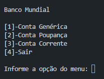

# Back-End - Desafio
## Projeto Back-End com JavaScript
#### Por:  iTalents

### Sobre o Projeto

Aplicação simples de sistema bancário em JavaScript com Node Js. Com conceitos de Herança e Polimorfismo. Inclui uma Conta Genérica, uma Conta Poupança e uma Conta Corrente.

##### About the project

Simple banking system application in JavaScript with Node Js. With concepts of Inheritance and Polymorphism. It includes a Generic Account, a Savings Account and a Current Account.

### Ferramentas de Desenvolvimento
##### (Development Tools)

* Visual Studio Code

### Técnicas Utilizadas
##### (Techniques Used)

* JavaScript
* Node Js
* Orientação a Objetos
* prompt-sync

### Instalar Dependências
##### (Install Dependencies)

``
npm install
``
### Executar Programa
##### (Run Program)

``
node index.js
``
### Autor (Author)
#### Katarine Albuquerque
###### Desenvolvedora Front-end (Developer)
   
